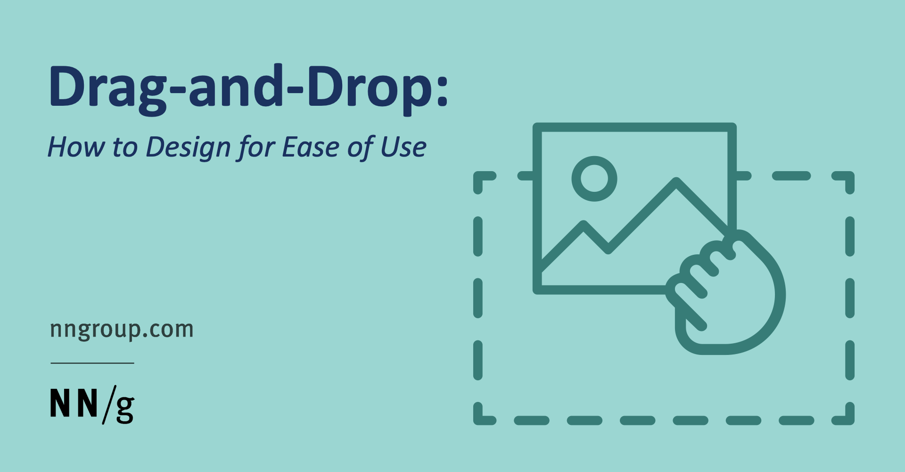

<a name="readme-top"></a>


<div align="center">

  
  <br/>

  <h3><b>Drag and Drop</b></h3>

</div>

# 📗 Table of Contents

- [📖 About the Project](#about-project)
  - [🛠 Built With](#built-with)
    - [Tech Stack](#tech-stack)
    - [Key Features](#key-features)
  - [🚀 Live Demo](#live-demo)
- [💻 Getting Started](#getting-started)
  - [Setup](#setup)
  - [Prerequisites](#prerequisites)
  - [Install](#install)
  - [Usage](#usage)
  - [Run tests](#run-tests)
  - [Deployment](#triangular_flag_on_post-deployment)
- [👥 Authors](#authors)
- [🔭 Future Features](#future-features)
- [🤝 Contributing](#contributing)
- [⭐️ Show your support](#support)
- [🙏 Acknowledgements](#acknowledgements)
- [❓ FAQ](#faq)
- [📝 License](#license)

<!-- PROJECT DESCRIPTION -->

# 📖 Drag and Drop <a name="about-project"></a>

In this Project we implement diferents things to use Typescript using Decorators and another libraries like webpack and Decorators


## 🛠 Built With <a name="built-with"></a>

### Tech Stack <a name="tech-stack"></a>

- TypeScript 
- Webpack

<details>
  <summary>Client</summary>
  <ul>
    <li><a href="https://reactjs.org/">Vanilla.js</a></li>
  </ul>
</details>


<!-- Features -->

### Key Features <a name="key-features"></a>

- **Implement Decorators with typescript**
- **implement Dom with generic types**
- **implement diferents configurations using Typescript**

<p align="right">(<a href="#readme-top">back to top</a>)</p>

<!-- LIVE DEMO -->

## 🚀 Live Demo <a name="live-demo"></a>


- [Live Demo Link](https://yourdeployedapplicationlink.com)

<p align="right">(<a href="#readme-top">back to top</a>)</p>

<!-- GETTING STARTED -->

## 💻 Getting Started <a name="getting-started"></a>

To get a local copy up and running, follow these steps.

### Prerequisites

In order to run this project you need:

```sh
 node 16.0
 webbrowser
```


### Setup

Clone this repository to your desired folder:


```sh
  cd my-folder
  git clone https://github.com/cvalencia1991/DragAndDrop.git
```


### Install

Install this project with:


```sh
  cd my-project
  npm install
```


### Usage

To run the project, execute the following command:


```sh
  npm install
  npm run dev
```


### Run tests

To run tests, run the following command:


```sh
  bin/rails test test/models/article_test.rb
```


### Deployment

You can deploy this project using:


```sh
npm run build
```


<p align="right">(<a href="#readme-top">back to top</a>)</p>

<!-- AUTHORS -->

## 👥 Authors <a name="authors"></a>


👤 **Cesar Alberto Valencia Aguilar**

- GitHub: [@githubhandle](https://github.com/cvalencia1991)
- Twitter: [@twitterhandle](https://twitter.com/cvalenciaguilar)
- LinkedIn: [LinkedIn](https://www.linkedin.com/in/cvalenciaguilar/)

<p align="right">(<a href="#readme-top">back to top</a>)</p>

<!-- FUTURE FEATURES -->


<p align="right">(<a href="#readme-top">back to top</a>)</p>

<!-- CONTRIBUTING -->

## 🤝 Contributing <a name="contributing"></a>

Contributions, issues, and feature requests are welcome!

Feel free to check the [issues page](../../issues/).

<p align="right">(<a href="#readme-top">back to top</a>)</p>

<!-- SUPPORT -->

## ⭐️ Show your support <a name="support"></a>


If you like this project please give a star ⭐️

<p align="right">(<a href="#readme-top">back to top</a>)</p>

<!-- ACKNOWLEDGEMENTS -->

## 🙏 Acknowledgments <a name="acknowledgements"></a>


I would like to thank...

<p align="right">(<a href="#readme-top">back to top</a>)</p>

<!-- FAQ (optional) -->

## ❓ FAQ <a name="faq"></a>

> Add at least 2 questions new developers would ask when they decide to use your project.

- **could you use this project without using decorators**

  - yes, you can use it but it could get more complicate using bind of the methods in the classes


<p align="right">(<a href="#readme-top">back to top</a>)</p>

<!-- LICENSE -->

## 📝 License <a name="license"></a>

This project is [MIT](./LICENSE) licensed.

_NOTE: we recommend using the [MIT license](https://choosealicense.com/licenses/mit/) - you can set it up quickly by [using templates available on GitHub](https://docs.github.com/en/communities/setting-up-your-project-for-healthy-contributions/adding-a-license-to-a-repository). You can also use [any other license](https://choosealicense.com/licenses/) if you wish._

<p align="right">(<a href="#readme-top">back to top</a>)</p>
